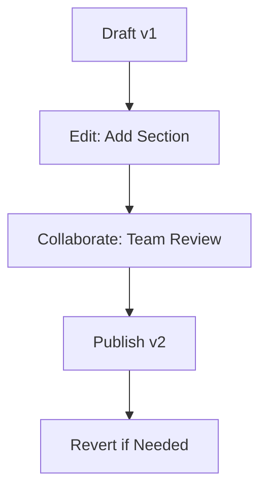

## Overview

Paperguide-pay provides powerful tools for teams to create, collaborate on, and manage documentation efficiently. You get rich text editing, real-time collaboration, version history, advanced search, and flexible export options—all in one platform. These features streamline your workflow from initial draft to final sharing.

<Columns cols={3}>
  <Card title="Document Creation" icon="edit-3" href="#document-creation">
    Build rich documents with formatting tools and embeds.
  </Card>
  <Card title="Team Collaboration" icon="users" href="#collaboration">
    Edit together in real-time with comments and permissions.
  </Card>
  <Card title="Version Control" icon="git-branch" href="#version-control">
    Track changes and revert with full history.
  </Card>
</Columns>

<Columns cols={2}>
  <Card title="Search & Tagging" icon="search" href="#search-tagging">
    Find content quickly with tags and full-text search.
  </Card>
  <Card title="Export & Sharing" icon="share-2" href="#export-sharing">
    Publish and export in multiple formats.
  </Card>
</Columns>

## Document Creation and Formatting Tools

Create professional documents quickly using Paperguide-pay's intuitive editor. You support Markdown, rich text, headings, lists, tables, and embeds like images or videos.

<Steps>
  <Step title="Start a New Document" icon="plus">
    Click the `New Document` button in your dashboard.
  </Step>
  <Step title="Format Content" icon="type">
    Use the toolbar for bold, italics, links, and code blocks.
  </Step>
  <Step title="Add Media" icon="image">
    Drag-and-drop images or paste URLs for embeds.
  </Step>
</Steps>

<Callout kind="tip">
  Enable live preview mode to see formatted output as you type.
</Callout>

## Collaboration Features for Team Editing

Invite team members to co-edit documents in real-time. You assign roles like editor or viewer, add comments, and track who made changes.

<Tabs>
  <Tab title="Real-time Editing" icon="activity">
    Multiple users edit simultaneously with cursor indicators.
  </Tab>
  <Tab title="Comments & Mentions" icon="message-circle">
    Leave inline comments with `@username` mentions for notifications.
  </Tab>
</Tabs>

## Version Control and History Tracking

Paperguide-pay automatically saves versions, letting you view diffs and restore previous states. Access history via the document menu.



<Expandable title="Advanced Version Options" default-open="false">
  Compare versions side-by-side or export history as a ZIP.
</Expandable>

## Search and Tagging Functionalities

Tag documents for organization and use powerful search across your workspace. Full-text search indexes content, titles, and tags.

<CodeGroup tabs="JavaScript,Python">
  ```javascript
  const response = await fetch('https://api.example.com/search?q=documentation&tags=guide');
  const results = await response.json();
  console.log(results.documents);
  ```
  ```python
  import requests
  response = requests.get('https://api.example.com/search', params={
    'q': 'documentation',
    'tags': 'guide'
  })
  results = response.json()
  print(results['documents'])
  ```
</CodeGroup>

## Export and Sharing Options

Share documents publicly or privately, and export to PDF, HTML, Markdown, or Word.

| Format | Use Case | Supported |
|--------|----------|-----------|
| PDF | Printing, reports | Full styling |
| Markdown | Git repos | Raw source |
| HTML | Websites | Interactive |
| Word | Legacy tools | Basic |

<Callout kind="success">
  Use secure sharing links with expiration dates and password protection.
</Callout>

These features make Paperguide-pay your go-to for team documentation. Start by creating your first document today.