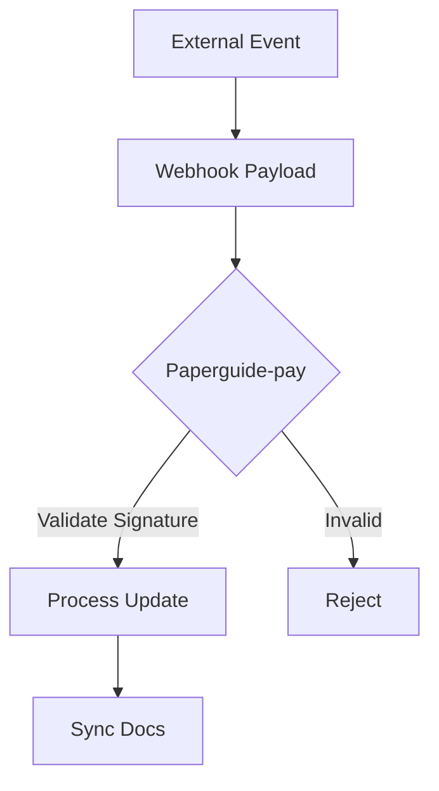

## Overview

Paperguide-pay supports seamless integrations with popular tools to streamline your documentation workflows. Sync content from GitHub or GitLab repositories, set up webhooks for real-time updates, embed external videos or APIs, and connect productivity apps. These integrations help you automate publishing, collaborate efficiently, and extend functionality without custom development.

<Columns cols={3}>
  <Card title="GitHub" icon="github" href="#github-integration">
    Sync docs directly from repositories.
  </Card>
  <Card title="GitLab" icon="git-branch" href="#gitlab-integration">
    Mirror changes from GitLab projects.
  </Card>
  <Card title="Webhooks" icon="zap" href="#webhooks">
    Receive instant event notifications.
  </Card>
</Columns>

## GitHub Integration

Connect your GitHub repository to Paperguide-pay to automatically publish documentation updates. You create a connection in your dashboard, grant permissions, and configure sync rules.

<Steps>
  <Step title="Create Connection" icon="link">
    Navigate to Settings > Integrations in your Paperguide-pay dashboard.

    Select GitHub and authorize the app.
  </Step>
  <Step title="Select Repository" icon="repo">
    Choose the repository containing your MDX docs.

    Specify the branch, like `main` or `docs`.
  </Step>
  <Step title="Configure Sync" icon="settings">
    Set triggers for push events and file paths, such as `docs/**/*.mdx`.

    Test the connection to verify.
  </Step>
</Steps>

<Callout kind="tip">
  Use branch protection rules in GitHub to ensure only approved changes trigger syncs.
</Callout>

## GitLab Integration

GitLab integration works similarly but uses GitLab's API for authentication.

<Tabs>
  <Tab title="OAuth" icon="key">
    Generate an OAuth token in GitLab: Project > Settings > Access Tokens.

    Paste it into Paperguide-pay's integration form.
  </Tab>
  <Tab title="Personal Token" icon="user">
    Create a personal access token with `api` and `read_repository` scopes.

    Enter the token and project ID.
  </Tab>
</Tabs>

## Webhooks

Set up webhooks to notify Paperguide-pay of external events, like form submissions or CI/CD completions. Configure the endpoint `https://api.paperguide-pay.com/v1/webhooks`.

<CodeGroup tabs="JavaScript,cURL,Python">
  ```javascript
  const webhookData = {
    event: 'doc_updated',
    payload: { repo: 'my-docs', path: 'guide.mdx' }
  };

  await fetch('https://api.paperguide-pay.com/v1/webhooks', {
    method: 'POST',
    headers: { 'Authorization': `Bearer ${YOUR_TOKEN}`, 'Content-Type': 'application/json' },
    body: JSON.stringify(webhookData)
  });
  ```
  ```bash
  curl -X POST https://api.paperguide-pay.com/v1/webhooks \
    -H "Authorization: Bearer YOUR_TOKEN" \
    -H "Content-Type: application/json" \
    -d '{
      "event": "doc_updated",
      "payload": {"repo": "my-docs", "path": "guide.mdx"}
    }'
  ```
  ```python
  import requests

  webhook_data = {
      'event': 'doc_updated',
      'payload': {'repo': 'my-docs', 'path': 'guide.mdx'}
  }

  headers = {
      'Authorization': 'Bearer YOUR_TOKEN',
      'Content-Type': 'application/json'
  }

  response = requests.post('https://api.paperguide-pay.com/v1/webhooks', json=webhook_data, headers=headers)
  ```
</CodeGroup>

<ParamField path="event" param-type="string" required="true">
  Event type, e.g., `doc_updated` or `page_published`.
</ParamField>

<ParamField header="Authorization" param-type="string" required="true">
  Bearer token for authentication.
</ParamField>

## Embedding External Content

Embed videos, iframes, or API previews directly in your docs.

<Expandable title="Video Embed Example" default-open="true">
  Use the `<Video>` component:

````jsx
<Video
  src="https://www.youtube.com/embed/dQw4w9WgXcQ"
  title="Tutorial Video"
  width="560"
  height="315"
/>
````

</Expandable>

For iframes, wrap in backticks for security: `<iframe src="https://example.com/widget"></iframe>`.

## Third-Party Apps

Connect tools like Slack or Zapier for notifications.

<Columns cols={2}>
  <Card title="Slack" icon="message-circle" href="https://slack.com" target="_blank">
    Send doc update alerts to channels.
  </Card>
  <Card title="Zapier" icon="zap" href="https://zapier.com" target="_blank">
    Automate workflows with 5000+ apps.
  </Card>
</Columns>

## Best Practices for Secure Integrations

<Callout kind="alert">
  Always use least-privilege tokens and rotate them regularly. Monitor webhook logs for anomalies.
</Callout>

<Expandable title="Advanced Security" default-open="false">
  Enable IP allowlisting in your Paperguide-pay settings.

  Validate payloads with HMAC signatures:

  ```javascript
  const crypto = require('crypto');
  const signature = crypto.createHmac('sha256', YOUR_WEBHOOK_SECRET)
    .update(payload)
    .digest('hex');
  ```
</Expandable>



Follow these practices to maintain secure, reliable integrations. Explore [Quickstart](/quickstart) for initial setup.