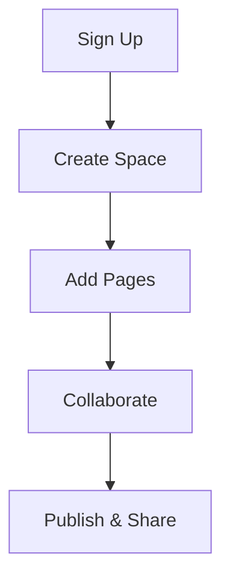

## Overview

Paperguide-pay empowers you to streamline your project documentation like never before. As a SaaS platform, it provides intuitive tools to create, organize, collaborate on, and publish documentation spaces for any project. You benefit from real-time collaboration, version history, and seamless search, reducing documentation chaos and boosting team productivity.

Whether you manage software projects, internal wikis, or client deliverables, Paperguide-pay handles it all. You get a centralized hub where teams access up-to-date docs without email chains or scattered files.

<Callout kind="info">
Paperguide-pay integrates with your existing workflows via APIs at `https://api.example.com` and webhooks.
</Callout>

## Key Features

Paperguide-pay stands out with powerful features designed for modern teams.

<Columns cols={3}>
  <Card title="Intuitive Organization" icon="layers" href="/docs/features">
    Structure docs into spaces, folders, and pages with drag-and-drop simplicity. Use tags and search for instant access.
  </Card>
  <Card title="Real-Time Collaboration" icon="users" href="/docs/collaboration">
    Edit docs simultaneously with teammates. Track changes and resolve conflicts effortlessly.
  </Card>
  <Card title="Version Control & History" icon="git-branch" href="/docs/versioning">
    Roll back changes, compare versions, and maintain audit trails for compliance.
  </Card>
</Columns>

## Who Should Use Paperguide-pay

You should choose Paperguide-pay if you are a developer needing API docs, a product manager organizing roadmaps, a support team building knowledge bases, or any professional tired of outdated docs. Small startups scale effortlessly, while enterprises appreciate role-based access and integrations.

## Quick Navigation

Jumpstart your journey with these essential resources.

<Columns cols={2}>
  <Card title="Quickstart" icon="rocket" href="/quickstart">
    Set up your first documentation space in under 5 minutes.
  </Card>
  <Card title="Authentication" icon="shield" href="/authentication">
    Secure your account and API access.
  </Card>
  <Card title="Changelog" icon="git-commit" href="/changelog">
    Stay updated with the latest releases.
  </Card>
</Columns>

## Basic Workflow

Follow this simple workflow to get started.

<Steps>
  <Step title="Sign Up" icon="user-plus">
    Create your account at `https://dashboard.example.com/signup`. Verify your email to unlock full features.
  </Step>
  <Step title="Create a Space" icon="plus">
    Navigate to your dashboard and click "New Space". Name it for your project, like "MyApp Docs".
  </Step>
  <Step title="Add Your First Page" icon="file-text">
    Use the editor to write Markdown or import from GitHub. Preview and publish instantly.
  </Step>
  <Step title="Invite Collaborators" icon="mail">
    Share the space link or add emails. Set permissions for view, edit, or admin roles.
  </Step>
</Steps>



<Callout kind="tip">
Explore the <a href="/quickstart">Quickstart guide</a> next to build your first space. For API integration, use `{YOUR_API_KEY}` from your dashboard settings.
</Callout>

<Tabs>
  <Tab title="Embed Example" icon="code">
````html
<iframe src="https://dashboard.example.com/embed/{spaceId}" width="100%" height="600"></iframe>
````
  </Tab>
  <Tab title="API Quick Call" icon="zap">
<CodeGroup tabs="JavaScript,cURL">
````javascript
const response = await fetch('https://api.example.com/v1/spaces', {
  headers: { Authorization: `Bearer ${YOUR_API_KEY}` }
});
const spaces = await response.json();
console.log(spaces);
````
````bash
curl -H "Authorization: Bearer YOUR_API_KEY" https://api.example.com/v1/spaces
````
</CodeGroup>
  </Tab>
</Tabs>